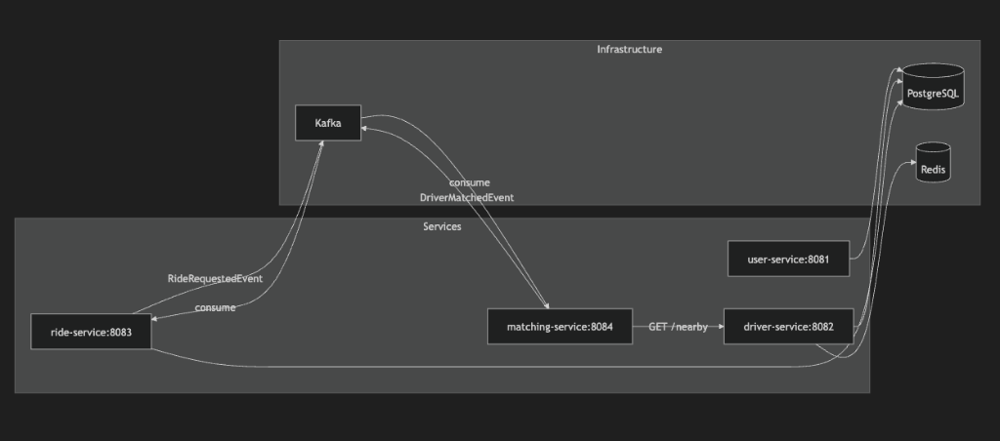
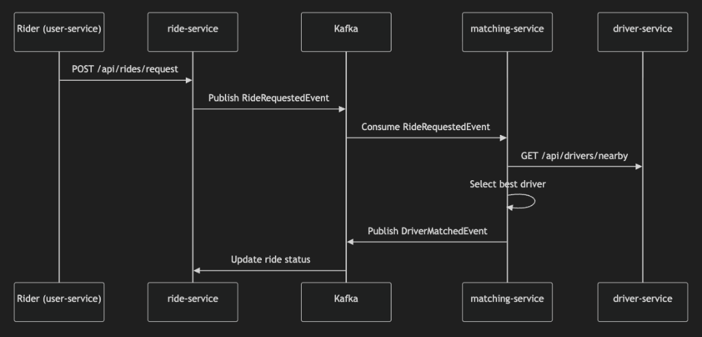

# Scalable Ride-Hailing Platform

A distributed, event-driven backend system that simulates the core functionalities of a modern ride-hailing service like Uber or Lyft. Built with **microservices architecture**, this project handles high-concurrency, real-time data streams, and resilient inter-service communication.

## 🚀 Services

| Service | Port | Description |
|---------|------|-------------|
| **user-service** | 8081 | User registration, login, JWT authentication |
| **driver-service** | 8082 | Driver management, Redis geospatial location tracking |
| **ride-service** | 8083 | Ride lifecycle management, Kafka event producer |
| **matching-service** | 8084 | Event-driven driver matching engine |

## 🏗️ Architecture

### Infrastructure


### Event Flow


## ✨ Features

- **JWT Authentication** - Stateless, secure token-based auth for riders and drivers
- **Redis Geospatial Tracking** - Real-time driver locations using `GEOADD`/`GEORADIUS`
- **Kafka Event Streaming** - `RideRequestedEvent` → `DriverMatchedEvent` flow
- **Driver Matching Algorithm** - Finds nearest available driver within radius
- **Ride Lifecycle** - REQUESTED → MATCHED → IN_PROGRESS → COMPLETED

## 🛠️ Tech Stack

| Category | Technology |
|----------|------------|
| **Language** | Java 17 |
| **Framework** | Spring Boot 3.2.5, Spring Security |
| **Database** | PostgreSQL 14 |
| **Cache** | Redis 6.2 (Geospatial) |
| **Messaging** | Apache Kafka |
| **Tracing** | Zipkin |
| **Auth** | JWT (jjwt) |
| **Build** | Maven, Docker Compose |

## 🚦 Getting Started

### Prerequisites
- Java 17+
- Maven 3.8+
- Docker & Docker Compose

### Run Locally

```bash
# Start infrastructure
docker-compose up -d

# Start services (wait ~30s for Kafka)
mvn spring-boot:run -f user-service/pom.xml &
mvn spring-boot:run -f driver-service/pom.xml &
mvn spring-boot:run -f ride-service/pom.xml &
mvn spring-boot:run -f matching-service/pom.xml &
```

### Test the Flow

```bash
# 1. Register a user (save the token from response)
curl -X POST http://localhost:8081/api/users/register \
  -H "Content-Type: application/json" \
  -d '{"name":"John","email":"john@example.com","password":"pass123","phoneNumber":"1234567890"}'

# 2. Register a driver (save the token from response)
curl -X POST http://localhost:8082/api/drivers/register \
  -H "Content-Type: application/json" \
  -d '{"name":"Jane","email":"jane@driver.com","password":"pass123","phoneNumber":"9876543210","vehicleNumber":"KA01AB1234","vehicleType":"SEDAN"}'

# 3. Set driver online + update location
curl -X PUT "http://localhost:8082/api/drivers/availability?available=true" \
  -H "Authorization: Bearer <driver_token>"

curl -X PUT http://localhost:8082/api/drivers/location \
  -H "Authorization: Bearer <driver_token>" \
  -H "Content-Type: application/json" \
  -d '{"latitude":12.9716,"longitude":77.5946}'

# 4. Request a ride (save the rideId from response)
curl -X POST http://localhost:8083/api/rides/request \
  -H "Authorization: Bearer <user_token>" \
  -H "Content-Type: application/json" \
  -d '{"pickupLat":12.9716,"pickupLng":77.5946,"destLat":12.93,"destLng":77.62}'

# 5. Trigger matching
curl -X POST http://localhost:8084/api/matching/trigger \
  -H "Content-Type: application/json" \
  -d '{"rideId":"<ride_id>","riderId":"123","pickupLocation":{"latitude":12.9716,"longitude":77.5946},"destination":{"latitude":12.93,"longitude":77.62}}'

# 6. Check ride status (should show driverId and "MATCHED" status)
curl http://localhost:8083/api/rides/<ride_id> \
  -H "Authorization: Bearer <user_token>"
```

## 📁 Project Structure

```
scalable-ride-hailing-platform/
├── user-service/          # User authentication
├── driver-service/        # Driver + location management
├── ride-service/          # Ride lifecycle + Kafka producer
├── matching-service/      # Driver matching + Kafka consumer
├── core-contracts/        # Shared event DTOs
├── docker-compose.yaml    # Infrastructure
└── pom.xml               # Parent POM
```

## 🗺️ Roadmap

- [x] User Service (JWT Authentication)
- [x] Driver Service (Redis Geospatial)
- [x] Ride Service (Kafka Producer)
- [x] Matching Service (Event-driven matching)
- [ ] API Gateway (Spring Cloud Gateway)
- [ ] Service Discovery (Eureka)
- [ ] Payment Integration

## 📝 License

MIT
